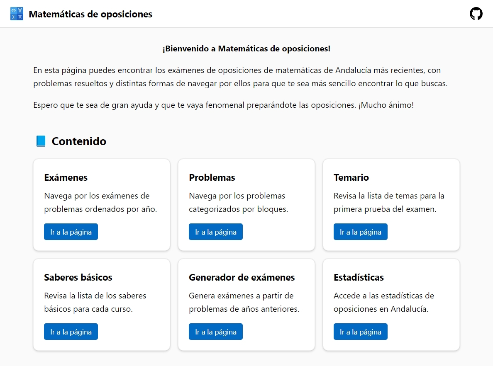

# Matemáticas de oposiciones

Matemáticas de oposiciones es una página web para ver los exámenes de oposiciones de matemáticas, navegar por los problemas de forma sencilla y revisar sus resoluciones. También cuenta con contenido adicional, como problemas semanales y un generador de exámenes.

La página hace uso de [MathJax](https://www.mathjax.org/) para mostrar los problemas directamente en el navegador y de [Chart.js](https://www.chartjs.org/) para las gráficas de las estadísticas. Los exámenes están ordenados por año y los problemas están clasificados por ramas.

El diseño está inspirado en [Fluent Design](https://fluent2.microsoft.design), el lenguaje de diseño utilizado por Microsoft en Windows.

